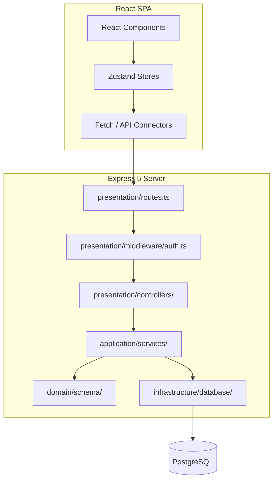

# 📐 System Architecture

> [!NOTE]
> Dev Studio is built around strict separation of concerns, modular dependency flow, and security-first request pipelines. This document details the architectural boundaries between the React frontend and the Clean Architecture backend.

---

## 🗺️ System Component Diagram

The interaction model below outlines how requests move from client UI interactions, through middlewares, controllers, and services, down to the database persistence layer.

---

## 🏗️ Backend Design: Clean Architecture

The backend code inside the `backend/src/` folder is separated into four layers following Clean Architecture principles. Dependencies always point inward:

### 1. 📂 Domain (`backend/src/domain/`)
- **Entities & Schemas**: Defines database tables using Drizzle ORM (under `domain/schema/`).
- **Enums & Constants**: Project-wide business enums (e.g., `AgentStatus`, `QuestionArea`).
- **Interfaces**: Contracts that describe data access operations or external services.
- *Has zero external dependencies on framework packages.*

### 2. 📂 Application (`backend/src/application/`)
- **Services**: Classes executing business logic and core features (e.g., computing progress scores, handling AI prompt calls).
- **Use Cases**: Specific orchestrations of domain structures and interfaces.

### 3. 📂 Infrastructure (`backend/src/infrastructure/`)
- **Database Connection**: Configures the PostgreSQL connection pool using Drizzle.
- **Seeds & Migrations**: Handles populating development tables with default data.
- **External Adapters**: Connectors to third-party services like OpenAI API or Slack webhook clients.

### 4. 📂 Presentation (`backend/src/presentation/`)
- **Controllers**: Receives HTTP requests, validates arguments, invokes application services, and returns HTTP responses.
- **Routes**: Directs HTTP endpoints to controllers.
- **Middleware**: Custom security filters (JWT verification, rate limiters, error catch-all routes).

---

## 🎨 Frontend Design: Single Page Application

The frontend inside the `frontend/` folder operates as a modern client-side React SPA:

- **State Management (Zustand)**: Client-side state is handled in stores (under `frontend/src/lib/store/`). Features like active sessions, prompt favorites, and UI dark/light modes sync with `localStorage` automatically.
- **Routing (TanStack Router)**: Type-safe client-side routing. Route setups are organized under `frontend/src/routes/` with automated layout wrappers and authorization checks.
- **Styling (Tailwind CSS v4)**: Atomic utility styling. Custom theme presets and variables are defined in `frontend/src/index.css`.
- **UI Components**: Uses atomic, accessible shadcn/ui structures with custom styling overlays.

---

## ⚡ Core Architecture Files Reference

Use the table below to locate the foundational files in the codebase:

| Path | Purpose |
| :--- | :--- |
| **[backend/src/index.ts](file:///c:/Users/Memo/Downloads/Dev%20Studio/Dev-Studio/backend/src/index.ts)** | The Express server entry point. Configures CORS, security headers, cookie parser, and starts listening. |
| **[backend/src/presentation/routes.ts](file:///c:/Users/Memo/Downloads/Dev%20Studio/Dev-Studio/backend/src/presentation/routes.ts)** | Core API route registration. Standardizes sub-routes (auth, interview prep, agents, prompts, snippets, templates). |
| **[backend/src/presentation/middleware/auth.ts](file:///c:/Users/Memo/Downloads/Dev%20Studio/Dev-Studio/backend/src/presentation/middleware/auth.ts)** | Session extraction and signature verification from the signed JWT cookie (`ds_token`). |
| **[backend/src/domain/schema.ts](file:///c:/Users/Memo/Downloads/Dev%20Studio/Dev-Studio/backend/src/domain/schema.ts)** | Aggregates all tables from modular schema files into a unified export for Drizzle ORM. |
| **[frontend/src/main.tsx](file:///c:/Users/Memo/Downloads/Dev%20Studio/Dev-Studio/frontend/src/main.tsx)** | Renders the React root element, mounts the TanStack Router provider, and registers TanStack Query client context. |
| **[frontend/src/lib/store/useAuthStore.ts](file:///c:/Users/Memo/Downloads/Dev%20Studio/Dev-Studio/frontend/src/lib/store/useAuthStore.ts)** | Zustand client store managing active user profile info, loading states, and auth checks. |
